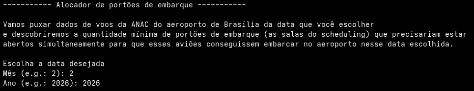
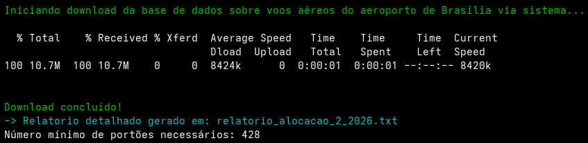
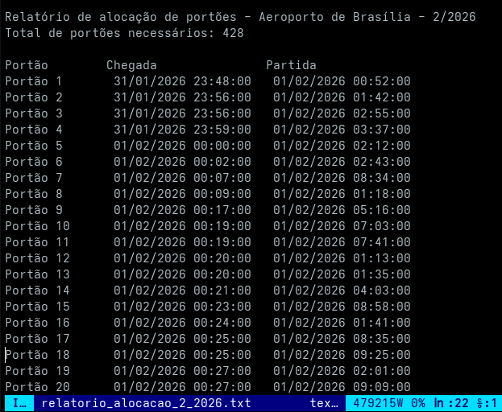

# G33_Greedy_PA_26.1
Trabalho de Projeto de Algoritmos do semestre 26.1 sobre Gananciosos.

# Alocador de portões de embarque

*Conteúdo da Disciplina*: Greedy <br>

## Alunos
|Matrícula | Aluno |
| -- | -- |
| 23/2014404  |  [Carlos Henrique Brasil de Souza](https://github.com/Carlos-UCH) |
| 23/2014576  |  [Yogi Nam de Souza Barbosa](https://github.com/oyogi)


## Sobre
Projeto desenvolvido por alunos da Universidade de Brasília(UnB) para a disciplina de Projeto de Algoritmos. 

O projeto consiste em com dados de voos da ANAC do aeroporto de Brasília determinar a quantidade mínima de portões de embarque que dever operar simultaneamente, garantindo o atendimento de todos os voos em uma data específica. 

## Link do Vídeo da Apresentação

colocar link:


## Screenshots



Recuperando informações de voos da ANAC do aeroporto de Brasília:




## Instalação 
*Linguagem*: C++<br>

## Clone o repositório  
 ```sh 
    $git git@github.com:projeto-de-algoritmos-2026/G33_Greedy_PA_26.1.git
    $cd G33_Greedy_PA_26.1
 ```

### Pre-requisitos
- Ter o C++20 instalado.
- Editor de texto

## Uso
Rode no terminal: 
```sh 
    $g++ -O2 -std=c++20 main.cpp csv_download.cpp csv_parser.cpp -o airport
    $./airport
```
 - Escolha uma data válida(mês e ano)
 - Abra o arquivo .txt 

 